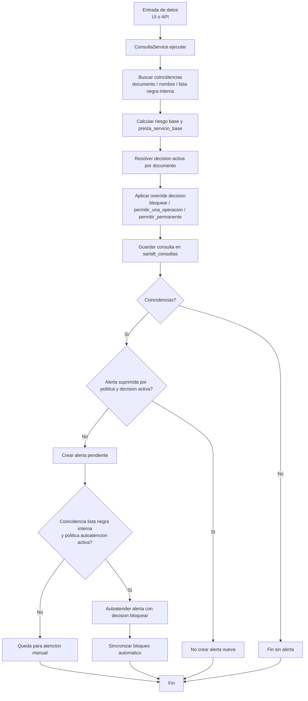
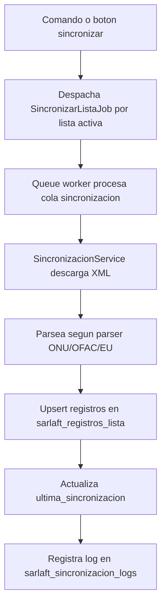
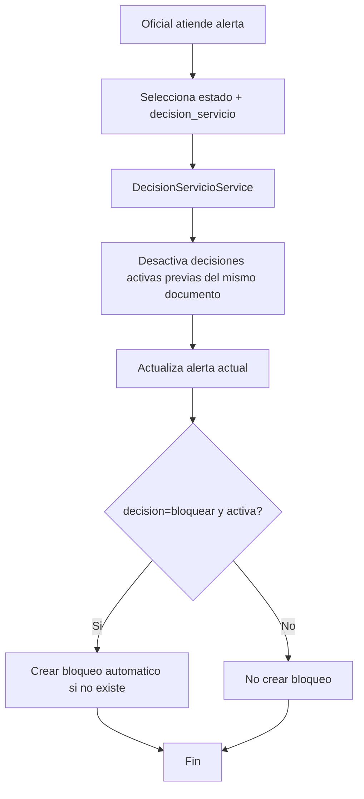

# Manual Funcional y Tecnico SARLAFT

## 1. Portada

- **Proyecto:** Autogestion2 - Modulo SARLAFT
- **Version manual:** 1.0.0
- **Fecha:** 2026-03-05
- **Audiencia principal:** Oficial de Cumplimiento y Administradores SARLAFT
- **Alcance:** Operacion funcional diaria + referencias tecnicas de soporte

---

## 2. Indice

1. [Objetivo del modulo](#3-objetivo-del-modulo)
2. [Roles y responsabilidades](#4-roles-y-responsabilidades)
3. [Mapa del modulo SARLAFT](#5-mapa-del-modulo-sarlaft)
4. [Flujo end-to-end de una consulta](#6-flujo-end-to-end-de-una-consulta)
5. [Manual operativo por pantalla](#7-manual-operativo-por-pantalla)
6. [Politicas y decisiones de servicio](#8-politicas-y-decisiones-de-servicio)
7. [Automatizaciones y mantenimiento](#9-automatizaciones-y-mantenimiento)
8. [Trazabilidad de datos (tablas)](#10-trazabilidad-de-datos-tablas)
9. [API SARLAFT para sistemas consumidores](#11-api-sarlaft-para-sistemas-consumidores)
10. [Escenarios practicos (playbook)](#12-escenarios-practicos-playbook)
11. [Troubleshooting](#13-troubleshooting)
12. [Checklist operativo diario](#14-checklist-operativo-diario)
13. [Control de version del manual](#15-control-de-version-del-manual)

---

## 3. Objetivo del modulo

El modulo SARLAFT permite:

- Consultar personas u organizaciones contra listas vinculantes e internas.
- Determinar si se presta o no el servicio segun riesgo, bloqueos y decisiones de cumplimiento.
- Gestionar alertas, bloqueos y lista negra interna.
- Sincronizar listas de referencia.
- Mantener trazabilidad de consultas y decisiones.

---

## 4. Roles y responsabilidades

| Rol | Que hace en SARLAFT |
|---|---|
| Oficial de Cumplimiento | Atiende alertas, define decision de servicio y estado operativo. |
| Administrador SARLAFT | Configura politicas, listas, sincronizacion y sistemas consumidores. |
| Operador (usuario interno) | Ejecuta simulaciones (pasajes/remesas) y revisa resultados. |
| Sistema consumidor (API) | Consume endpoints de consulta con token y limite de velocidad. |

---

## 5. Mapa del modulo SARLAFT

Rutas web principales (prefijo `/sarlaft`):

| Pantalla | Ruta | Nombre de ruta |
|---|---|---|
| Dashboard | `GET /sarlaft` | `sarlaft.dashboard` |
| Politicas | `GET /sarlaft/politicas` | `sarlaft.politicas.edit` |
| Alertas | `GET /sarlaft/alertas` | `sarlaft.alertas.index` |
| Detalle alerta | `GET /sarlaft/alertas/{alerta}` | `sarlaft.alertas.show` |
| Atender alerta | `PATCH /sarlaft/alertas/{alerta}/atender` | `sarlaft.alertas.atender` |
| Bloqueos | `GET /sarlaft/bloqueos` | `sarlaft.bloqueos.index` |
| Crear bloqueo | `GET /sarlaft/bloqueos/crear` | `sarlaft.bloqueos.create` |
| Lista negra (CRUD) | `GET/POST/PUT/DELETE /sarlaft/lista-negra` | `sarlaft.lista-negra.*` |
| Sistemas consumidores | `GET /sarlaft/sistemas-consumidores` | `sarlaft.sistemas-consumidores.index` |
| Sincronizacion | `GET /sarlaft/sincronizacion` | `sarlaft.sincronizacion.index` |
| Simulaciones | `GET /sarlaft/simulaciones` | `sarlaft.simulaciones.index` |

---

## 6. Flujo end-to-end de una consulta



### 6.1 Reglas clave del motor de consulta

1. Coincidencias se buscan por:
   - Documento exacto en `sarlaft_registros_lista`.
   - Nombre similar (fulltext + scoring).
   - Documento exacto en `sarlaft_lista_negra_interna`.
2. Riesgo base:
   - `alto` si bloqueo activo o coincidencia critica.
   - `ninguno` si no hay coincidencias ni bloqueo.
   - `medio/bajo` segun cantidad y calidad de coincidencias.
3. Decision activa puede sobreescribir resultado base:
   - `bloquear` fuerza no prestar servicio.
   - `permitir_permanente` fuerza prestar servicio.
   - `permitir_una_operacion` permite solo la primera consulta bloqueante y luego se consume.
4. Si existe decision activa y politica de supresion habilitada:
   - No se crean alertas repetidas para `bloquear` y/o `permitir_permanente`.

---

## 7. Manual operativo por pantalla

## 7.1 Dashboard

Muestra KPIs:

- Consultas hoy / mes.
- Alertas pendientes / en revision.
- Bloqueos activos.
- Registros activos en lista negra.
- Ultimas alertas pendientes.
- Ultimos logs de sincronizacion.

Uso recomendado:

1. Revisar primero alertas pendientes y en revision.
2. Validar que hubo sincronizacion reciente sin errores.

## 7.2 Simulaciones (Pasajes y Remesas)

Pantalla: `sarlaft.simulaciones.index`

### 7.2.1 Simulacion de compra de tiquete

Campos obligatorios:

| Campo | Validacion |
|---|---|
| Ciudad origen | municipio existente |
| Ciudad destino | municipio existente y diferente origen |
| Fecha viaje | fecha valida |
| Tipo documento | string max 20 |
| Documento | string max 50 |
| Nombres | string max 150 |
| Apellidos | string max 150 |
| Direccion | string max 250 |
| Telefono | string max 30 |
| Correo | email max 150 |

Que guarda:

- Consulta en `sarlaft_consultas`.
- Registro operativo en `sarlaft_simulacion_pasajes`.
- Alerta en `sarlaft_alertas` (solo si aplica).

Correo a oficial:

- Se envia a `desarrollo2@copetran.com` solo si:
  - hay coincidencias (`encontrado = true`),
  - **no** hubo supresion de alerta por decision activa,
  - y el resultado es bloqueante (`presta_servicio = false`) o riesgo alto.

### 7.2.2 Simulacion de remesa

Campos obligatorios:

| Campo | Validacion |
|---|---|
| Ciudad origen | municipio existente |
| Ciudad destino | municipio existente y diferente origen |
| Fecha envio | fecha valida |
| Tipo documento | string max 20 |
| Documento remitente | string max 50 |
| Nombres remitente | string max 150 |
| Apellidos remitente | string max 150 |
| Telefono remitente | string max 30 |
| Nombre destinatario | string max 300 |
| Documento destinatario | string max 50 |
| Monto | numerico 0.01 a 999999999999.99 |
| Concepto | string max 500 |

Que guarda:

- Consulta en `sarlaft_consultas`.
- Registro operativo en `sarlaft_simulacion_remesas`.
- Alerta en `sarlaft_alertas` (solo si aplica).

---

## 7.3 Alertas

Pantallas:

- Listado: `sarlaft.alertas.index`
- Detalle/atencion: `sarlaft.alertas.show`

### 7.3.1 Campos funcionales de una alerta

| Campo | Significado |
|---|---|
| `estado` | Estado operativo de la gestion (`pendiente`, `en_revision`, `atendida`, `descartada`). |
| `decision_servicio` | Decision que impacta consultas futuras (`sin_decision`, `bloquear`, `permitir_una_operacion`, `permitir_permanente`). |
| `decision_activa` | Indica si esa decision sigue vigente. |
| `decision_consumida_at` | Fecha en que se consumio `permitir_una_operacion`. |
| `escalada_automatica` | Si fue atendida automaticamente por SLA. |
| `contexto_operacion` | Metadatos de trazabilidad (manual/auto, supresion, ids relacionados). |

### 7.3.2 Atender una alerta (proceso)

1. Abrir alerta.
2. Definir `estado`.
3. Definir `decision_servicio`.
4. Registrar `notas`.
5. Guardar.

Efectos:

- Si decision activa nueva para mismo documento:
  - se desactivan decisiones activas anteriores de otras alertas.
- Si decision es `bloquear`:
  - se crea bloqueo automatico en `sarlaft_bloqueos` si no existe activo.
- Si decision es `sin_decision` o `permitir_una_operacion`:
  - se limpia marca de consumo para nuevo ciclo.

---

## 7.4 Bloqueos

Pantallas:

- Listado: `sarlaft.bloqueos.index`
- Crear manual: `sarlaft.bloqueos.create`
- Detalle/desbloqueo: `sarlaft.bloqueos.show`

Tipos:

- `manual`: creado por usuario en pantalla.
- `automatico`: creado por decision de alerta = `bloquear`.

Estados:

- `bloqueado`
- `desbloqueado`

Desbloqueo:

1. Ingresar justificacion obligatoria.
2. Opcional: registrar referencias en `documentos_soporte`.

Nota funcional importante:

- En consultas futuras, la **decision activa** de alerta tiene prioridad operativa sobre el bloqueo almacenado.
- Ejemplo: si existe bloqueo, pero decision activa `permitir_permanente`, la consulta puede prestar servicio.

---

## 7.5 Lista Negra Interna

Pantallas:

- Listado: `sarlaft.lista-negra.index`
- Crear: `sarlaft.lista-negra.create`
- Editar: `sarlaft.lista-negra.edit`
- Ver: `sarlaft.lista-negra.show`

Campos:

| Campo | Regla |
|---|---|
| Tipo entidad | `persona` o `organizacion` |
| Tipo documento | `CC`, `NIT`, `CE`, `PA` |
| Numero documento | unico por tipo+numero |
| Nombres | requerido |
| Motivo | requerido |
| Estado (editar) | `activo` o `inactivo` |

Efecto en consulta:

- Coincidencia en lista negra interna se marca como coincidencia critica.
- Si politica de autoatencion esta activa:
  - se crea alerta,
  - se atiende automaticamente con decision `bloquear`,
  - se sincroniza bloqueo automatico.

---

## 7.6 Sincronizacion de listas

Pantalla: `sarlaft.sincronizacion.index`

Funciones:

1. Crear lista vinculante manual.
2. Cargar listas desde `config/listas.php`.
3. Boton **Sincronizar ahora (dev)**:
   - solo en entorno `local/development/dev`,
   - maximo 1 vez por dia (control por cache diario),
   - encola jobs para listas activas.
4. Revisar historial de sincronizacion.

### 7.6.1 Flujo tecnico de sincronizacion



Parsers soportados:

- ONU
- OFAC (XML SDN)
- EU

---

## 7.7 Sistemas consumidores (API)

Pantalla: `sarlaft.sistemas-consumidores.index`

Campos de creacion:

| Campo | Regla |
|---|---|
| Nombre | requerido, max 100 |
| Codigo | requerido, unico, max 50 |
| Limite req/min | requerido, 1 a 10000 |

Al crear:

- Se genera `api_token` aleatorio de 64 chars.
- Estado inicial `activo`.

Uso del token:

- En header `Authorization: Bearer <token>`.
- Middleware valida token y estado del sistema.
- Middleware aplica rate limit por `codigo`.

---

## 8. Politicas y decisiones de servicio

Pantalla: `sarlaft.politicas.edit`

Parametros configurables:

| Politica | Efecto |
|---|---|
| `suppress_alert_on_bloquear` | Suprime alerta repetida si existe decision activa `bloquear`. |
| `suppress_alert_on_permitir_permanente` | Suprime alerta repetida si existe decision activa `permitir_permanente`. |
| `sla_dias_alerta` | Dias para considerar vencida una alerta pendiente. |
| `auto_escalar_riesgos` | Riesgos que aplican para autoescalamiento por SLA. |
| `auto_estado` | Estado operativo aplicado automaticamente en vencidas. |
| `auto_decision` | Decision aplicada automaticamente en vencidas. |
| `auto_atender_lista_negra_interna` | Activa autoatencion inmediata por lista negra interna. |
| `auto_crear_alerta_atendida` | Mantiene trazabilidad creando alerta y marcandola atendida. |
| `auto_user_id` | Usuario tecnico para acciones automaticas. |

Fallback:

- Si no existe registro en `sarlaft_politicas`, se usan valores de `config/sarlaft.php`.

### 8.1 Diagrama de atencion de alerta



---

## 9. Automatizaciones y mantenimiento

## 9.1 Scheduler actual

Archivo: `routes/console.php`

| Tarea | Frecuencia | Hora |
|---|---|---|
| `listas:sincronizar` | diaria | 02:00 |
| `sarlaft:archivar-consultas` | diaria | 03:00 |
| `sarlaft:procesar-alertas-vencidas` | cada hora | hh:00 |

Todas se ejecutan con `withoutOverlapping()`.

## 9.2 Comandos operativos

### 9.2.1 Encolar sincronizacion de listas

```bash
php artisan listas:sincronizar
```

Que hace:

- Busca listas activas.
- Despacha `SincronizarListaJob` para cada una.

### 9.2.2 Archivar consultas negativas antiguas

```bash
php artisan sarlaft:archivar-consultas --dry-run
php artisan sarlaft:archivar-consultas
```

Que archiva:

- Consultas sin alerta relacionada.
- `encontrado = false`
- `presta_servicio = true`
- `nivel_riesgo = ninguno`
- `created_at` menor al cutoff (default 180 dias).

Destino:

- Se mueven a `sarlaft_consultas_archivo`.

### 9.2.3 Procesar alertas vencidas por SLA

```bash
php artisan sarlaft:procesar-alertas-vencidas --dry-run
php artisan sarlaft:procesar-alertas-vencidas
```

Criterios:

- `estado = pendiente`
- Riesgo dentro de `auto_escalar_riesgos`
- `created_at <= now - sla_dias_alerta`
- No escalada automatica previa.

Accion:

- Atiende automaticamente con `auto_estado` + `auto_decision`.
- Marca `escalada_automatica`.
- Sincroniza bloqueo si corresponde.

## 9.3 Cola de trabajos (queue worker)

Para procesar jobs de sincronizacion:

```bash
php artisan queue:work --queue=sincronizacion,default
```

`jobs` table:

- Si `QUEUE_CONNECTION=database`, la tabla `jobs` debe existir.
- Si no existe, crear migracion de queue y migrar.

---

## 10. Trazabilidad de datos (tablas)

## 10.1 Tablas principales

| Tabla | Uso |
|---|---|
| `sarlaft_consultas` | Registro caliente de todas las consultas ejecutadas. |
| `sarlaft_alertas` | Casos con coincidencia y su ciclo de atencion/decision. |
| `sarlaft_bloqueos` | Bloqueos manuales y automaticos. |
| `sarlaft_lista_negra_interna` | Lista interna de prohibicion/alto control. |
| `sarlaft_listas_vinculantes` | Catalogo de listas externas/internas a sincronizar. |
| `sarlaft_registros_lista` | Registros individuales de cada lista sincronizada. |
| `sarlaft_sincronizacion_logs` | Resultado de cada corrida de sincronizacion. |
| `sarlaft_sistemas_consumidores` | Clientes API con token y limite de requests. |
| `sarlaft_simulacion_pasajes` | Intencion operativa y resultado de simulaciones de pasajes. |
| `sarlaft_simulacion_remesas` | Intencion operativa y resultado de simulaciones de remesas. |
| `sarlaft_consultas_archivo` | Historico frio de consultas negativas archivadas. |
| `sarlaft_mantenimiento_logs` | Auditoria de procesos de archivo/escalamiento. |
| `sarlaft_politicas` | Politicas operativas persistidas en BD. |

## 10.2 Campo `contexto_operacion` en consultas

Se usa para auditoria de decisiones y flujo aplicado. Campos clave:

| Campo | Significado |
|---|---|
| `decision_aplicada` | Decision activa detectada al consultar. |
| `decision_alerta_id` | Alerta origen de la decision activa. |
| `decision_consumida` | Si se consumio una decision de una sola operacion. |
| `presta_servicio_base` | Resultado antes de aplicar decision activa. |
| `presta_servicio_final` | Resultado final despues de decision activa. |
| `coincidencia_lista_negra_interna` | Si hubo match con lista negra interna. |
| `alerta_suprimida` | Si no se creo alerta por politicas de supresion. |
| `motivo_suprimir_alerta` | Motivo tecnico de supresion. |
| `alerta_id` | ID de alerta creada (si aplica). |
| `origen_atencion` | `manual`, `auto_sla`, `auto_lista_negra_interna`, etc. |

Momento de actualizacion:

1. Se crea consulta con contexto inicial.
2. Se ajusta si hubo consumo de `permitir_una_operacion`.
3. Se vuelve a actualizar al final con `alerta_id`, supresion y origen.

## 10.3 Campo `contexto_operacion` en alertas

Guarda metadatos de como se atendio/gestiono la alerta:

- origen de atencion (manual o automatica),
- supresiones relacionadas,
- trazabilidad de autoatencion o escalamiento.

## 10.4 Donde queda la intencion de operacion

- **Pasajes:** `sarlaft_simulacion_pasajes`.
- **Remesas:** `sarlaft_simulacion_remesas`.
- **Origen tecnico de consulta:** `sarlaft_consultas.sistema_origen` (ej: `simulacion_pasaje`, `simulacion_remesa`, `api`).

---

## 11. API SARLAFT para sistemas consumidores

Base: `/api/v1`

Endpoints:

| Metodo | Ruta | Descripcion |
|---|---|---|
| POST | `/consulta` | Consulta individual |
| POST | `/consulta/lote` | Consulta multiple (1..100 registros) |
| GET | `/consulta/{consulta}` | Ver detalle de consulta |

Autenticacion:

- Header `Authorization: Bearer <api_token>`
- Sistema debe estar activo.

Rate limit:

- Por sistema consumidor (`codigo`).
- Si excede: HTTP 429 y `retry_after_seconds`.

Payload consulta individual:

```json
{
  "tipo_documento": "CC",
  "numero_documento": "1098643625",
  "nombre": "NOMBRE APELLIDO"
}
```

Respuesta (resumen):

- `encontrado`
- `presta_servicio`
- `nivel_riesgo`
- `coincidencias`
- `alertas` (cuando se consulta detalle por id y se carga relacion)

---

## 12. Escenarios practicos (playbook)

## 12.1 Coincidencia bloqueante normal

1. Se consulta persona.
2. Hay match critico (documento/lista negra).
3. Resultado: `presta_servicio = false`, riesgo alto.
4. Se crea alerta pendiente.
5. Oficial atiende y decide.

## 12.2 Permitir una operacion (excepcion temporal)

1. Oficial atiende alerta con decision `permitir_una_operacion`.
2. Primera consulta futura que iba a bloquear:
   - se permite,
   - decision se consume (`decision_activa = false`).
3. Segunda consulta futura:
   - vuelve a aplicar logica normal.

## 12.3 Permitir permanente

1. Oficial define `permitir_permanente`.
2. Consultas futuras se permiten por decision activa.
3. Si politica de supresion esta activa:
   - no se crean alertas repetidas,
   - no se envia correo de simulacion por esos casos suprimidos.

## 12.4 Bloquear con decision activa

1. Oficial define `bloquear`.
2. Se crea bloqueo automatico si no existe.
3. Consultas futuras quedan no permitidas.
4. Si politica de supresion activa:
   - no se crean alertas repetidas para el mismo documento.

## 12.5 Alerta vencida por SLA

1. Alerta queda `pendiente` mas alla de `sla_dias_alerta`.
2. Comando horario de vencidas la procesa.
3. Queda atendida con estado/decision automatica configurada.
4. Se marca `escalada_automatica = true`.

## 12.6 Lista negra interna con autoatencion

1. Consulta detecta match en `sarlaft_lista_negra_interna`.
2. Se crea alerta para trazabilidad.
3. Se atiende automaticamente con decision `bloquear`.
4. Se crea bloqueo automatico.

---

## 13. Troubleshooting

## 13.1 Error: columna `tipo_documento` no existe en `sarlaft_alertas`

Sintoma:

- SQLSTATE 42S22 al consultar decisiones activas.

Causa:

- Migracion `2026_02_19_232931_add_decision_servicio_fields_to_sarlaft_alertas_table.php` no ejecutada.

Accion:

```bash
php artisan migrate --database=mysql-sarlaft --no-interaction
```

## 13.2 Error: tabla `jobs` no existe

Sintoma:

- SQLSTATE 42S02 insert into `jobs`.

Causa:

- Conexion de cola en `database` sin tabla `jobs`.

Accion:

1. Crear migracion de queue table.
2. Ejecutar migraciones en la BD de cola.
3. Levantar worker.

## 13.3 `sarlaft:procesar-alertas-vencidas` muestra 0 procesadas

Posibles causas:

- No hay alertas `pendiente`.
- Riesgo no esta en `auto_escalar_riesgos`.
- Alertas aun no cumplen cutoff (`now - sla_dias_alerta`).
- Ya estaban marcadas como `escalada_automatica`.

Accion:

1. Revisar politica SARLAFT.
2. Validar fechas reales de `created_at`.
3. Probar primero con `--dry-run`.

## 13.4 No veo ejecucion de sincronizacion despues de `listas:sincronizar`

Causa comun:

- Jobs encolados pero sin worker activo.

Accion:

```bash
php artisan queue:work --queue=sincronizacion,default
```

## 13.5 Se repiten correos pero no alertas

Comportamiento esperado actual:

- Si `alerta_suprimida = true` en contexto de consulta, simulaciones ya no deben notificar correo.

Validar:

1. `contexto_operacion.alerta_suprimida = true`
2. Decision activa (`bloquear` o `permitir_permanente`)
3. Politica de supresion correspondiente activa.

---

## 14. Checklist operativo diario

1. Revisar dashboard SARLAFT.
2. Atender alertas pendientes y en revision.
3. Verificar sincronizacion reciente sin errores.
4. Ejecutar diagnostico rapido si hay fallas de cola o migraciones.
5. Confirmar politicas SARLAFT vigentes.

Checklist tecnico de cierre:

1. `php artisan sarlaft:archivar-consultas --dry-run`
2. `php artisan sarlaft:procesar-alertas-vencidas --dry-run`
3. Revisar `storage/logs/laravel.log`
4. Revisar `sarlaft_mantenimiento_logs`

---

## 15. Control de version del manual

| Version | Fecha | Alcance | Autor |
|---|---|---|---|
| 1.0.0 | 2026-03-05 | Manual funcional + tecnico inicial del estado actual SARLAFT | Codex |

### Cambios incluidos en esta version

- Flujo end-to-end de consulta con decision activa.
- Manual por pantallas (dashboard, simulaciones, alertas, bloqueos, lista negra, sincronizacion, politicas, sistemas consumidores).
- Reglas de supresion de alertas y autoatencion.
- Comandos de mantenimiento con `dry-run`.
- Guia de trazabilidad por tablas y `contexto_operacion`.
- Playbook de escenarios operativos y troubleshooting.
