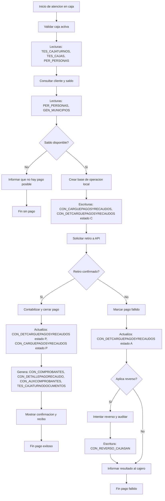

# Flujo Pago Cajasan (Mermaid)

## Notas rapidas para explicarlo
- `estado C`: operacion creada localmente, aun pendiente de confirmacion final.
- `estado P`: pago confirmado y contabilizado localmente.
- `estado A`: pago fallido/anulado localmente.
- `CON_REVERSO_CAJASAN`: bitacora de intentos de reverso y su resultado.
